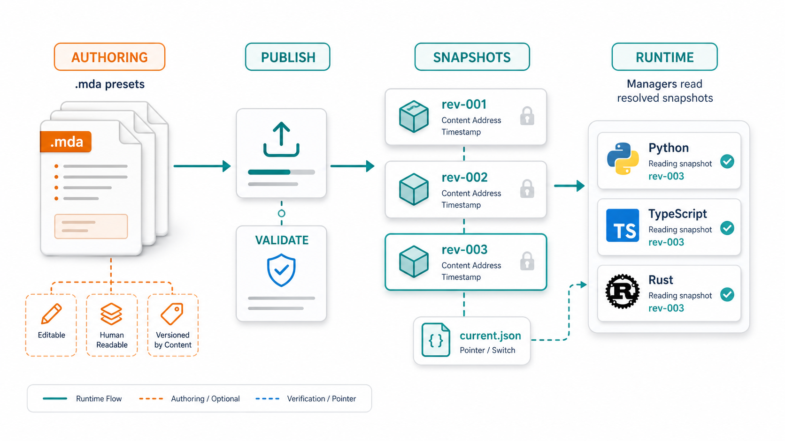

# LLMix

[](https://www.npmjs.com/package/@snoai/llmix)
[](https://pypi.org/project/llmix/)
[](https://www.python.org/downloads/)
[](https://www.typescriptlang.org/)
[](https://www.rust-lang.org/)
[](LICENSE)

> **Config-driven harness around your LLM SDK.**
> Swap models by editing MDA presets. Keep the SDK you already use.

LLMix sits **above** your existing LLM client — `openai`, `anthropic`, AI SDK, LiteLLM, anything with a callable signature — and wraps it with the production primitives you'd otherwise rebuild from scratch: an MDA-driven config layer, a two-tier response cache, a circuit breaker, key-pool rotation, and singleflight deduplication.

Provider, model, and parameters can live in a `.mda` preset. Edit the preset, publish or reload config, and get a different model at runtime. **No redeploy.**

---

## At a Glance


**Works with:** AI SDK v6 · `openai` (Py/JS) · `anthropic` · `google-genai` · LiteLLM · any async callable that returns your model's response.

---

## Three Things It Does

**Config-driven model swap.** Provider, model, and params are *data*, not code. Drop in a new MDA preset, the next call can route to a different provider. Built for agent harnesses that reshape behavior via config, not redeploys.

**Production resilience, no extra code.** Two-tier cache (L1 memory + L2 Redis), circuit breaker, key-pool rotation with auto-eviction of dead keys, single flight dedup, adaptive concurrency, retries that honor `Retry-After`. Composable with whatever SDK you already ship.

**Runtime parity.** Python, TypeScript, and Rust share byte-identical cache keys and retry semantics. Config authoring now uses MDA Source Mode across all three runtimes. (`llmix-rs` is currently beta — see [`rust/llmix-rs/README.md`](rust/llmix-rs/README.md).)

---

## Quick Start

### Python

```python
from llmix import (
    CallInput, CallPipeline, KeyPool, PipelineConfig,
    TwoTierCache, openai_dispatch,
)

pipeline = CallPipeline(PipelineConfig(
    dispatch=openai_dispatch(),
    response_cache=TwoTierCache("memory"),
))
pipeline.set_key_pool("openai", KeyPool(["sk-..."]))

response = await pipeline.call(CallInput(
    config={
        "provider": "openai",
        "model": "gpt-4.1-mini",
        "common": {"temperature": 0.7, "max_output_tokens": 1024},
        "caching": {"strategy": "memory"},
    },
    messages=[{"role": "user", "content": "Summarize this article..."}],
))

print(response.content, response.cache_hit)
```

### TypeScript

```typescript
import { CallPipeline, KeyPool, TwoTierCache, openaiDispatch } from "@snoai/llmix";

const pipeline = new CallPipeline({
  dispatch: openaiDispatch(),
  responseCache: new TwoTierCache("memory"),
});
pipeline.setKeyPool("openai", new KeyPool(["sk-..."]));

const response = await pipeline.call({
  config: {
    provider: "openai",
    model: "gpt-4.1-mini",
    common: { temperature: 0.2, maxOutputTokens: 2048 },
    caching: { strategy: "memory" },
  },
  messages: [{ role: "user", content: "Extract entities from this text." }],
});

console.log(response.content, response.usage);
```

### Rust

```rust
use llmix_rs::{
    CallInput, CallPipeline, DispatchContext, KeyPool, LlmUsage,
    PipelineConfig, ProviderResult,
};
use serde_json::json;

#[tokio::main(flavor = "current_thread")]
async fn main() -> Result<(), Box<dyn std::error::Error>> {
    let pipeline = CallPipeline::new(PipelineConfig::new(|ctx: DispatchContext| async move {
        Ok(ProviderResult {
            content: format!("echo: {}", ctx.messages.last().and_then(|m| m.get("content")).and_then(|v| v.as_str()).unwrap_or("")),
            model: ctx.model,
            usage: LlmUsage { input_tokens: 1, output_tokens: 2, total_tokens: 3 },
            headers: None,
            tool_calls: None,
        })
    }))?;
    pipeline.set_key_pool("openai", KeyPool::new(vec!["sk-...".into()])?);

    let response = pipeline.call(CallInput {
        config: json!({"provider": "openai", "model": "gpt-4o-mini"}),
        messages: vec![json!({"role": "user", "content": "Extract entities."})],
        singleflight_key: None,
    }).await;

    println!("{}", response.content);
    pipeline.close().await;
    Ok(())
}
```

### MDA Presets



```mda
---
name: extraction
description: Entity extraction preset.
metadata:
  snoai-llmix:
    common:
      provider: openai
      model: gpt-4.1-mini
      maxOutputTokens: 2048
      temperature: 0.2
    caching:
      strategy: redis-or-memory
    providerOptions:
      openai:
        reasoningEffort: medium
---
# extraction

Runtime settings plus human-readable operating notes live together.
```

---

## Inside Every Call


| Concern             | What LLMix does                                                                    |
|---------------------|------------------------------------------------------------------------------------|
| **Cache**           | L1 memory + optional Redis L2; cross-language byte-identical keys                  |
| **Concurrency**     | AIMD adaptive semaphore with rate-limit feedback                                   |
| **Dedup**           | Singleflight collapses identical concurrent calls into one upstream request        |
| **Failures**        | Retry with jittered exponential backoff; `Retry-After` honored                     |
| **Provider health** | Circuit breaker scoped to `(provider, endpoint)`                                   |
| **API keys**        | Round-robin pools; dead-key eviction on `401/403`; fast rotation on `429`          |
| **Request shaping** | Provider-specific kwargs transforms and capability filtering                       |
| **Output**          | Optional `<think>` token extraction; normalized response objects                   |

---

## Tested Against Real Providers

Every dispatcher below has a real-HTTP integration suite under `tests/integration/` — no mocks, no recorded fixtures.

| Provider    | Dispatcher                                  | Primary model under test         |
|-------------|---------------------------------------------|----------------------------------|
| OpenAI      | `openai_dispatch` / `openaiDispatch`        | `gpt-4o-mini`, `o4-mini`         |
| Anthropic   | `anthropic_dispatch` / `anthropicDispatch`  | `claude-haiku-4-5-20251001`      |
| Gemini      | `gemini_dispatch` / `geminiDispatch`        | `gemini-2.5-flash`               |
| OpenRouter  | `openrouter_dispatch` / `openrouterDispatch`| `deepseek/deepseek-v4-flash`     |
| DeepInfra   | `deepinfra_dispatch` / `deepinfraDispatch`  | `Qwen/Qwen3-32B`                 |
| Novita      | `novita_dispatch` / `novitaDispatch`        | `qwen/qwen3.5-27b`               |
| Together    | `together_dispatch` / `togetherDispatch`    | `Qwen/Qwen2.5-7B-Instruct-Turbo` |
| Sno GPU     | `sno_gpu_dispatch` / `snoGpuDispatch`       | `qwen3.6-27b-extract`            |

OpenRouter, DeepInfra, Novita, and Together are OpenAI-compatible — their dispatchers reuse the OpenAI client / `@ai-sdk/openai` with a provider-specific `base_url`. TypeScript dispatchers use AI SDK v6 where the provider supports it.

Cross-cutting suites (`test_e2e_cache.py`, `_concurrency`, `_parity`, `_redis`, `_resilience`, `_security`, `_thinking`) exercise the pipeline itself across every provider.

---

## Production Config: the Registry

Services that need atomic config updates use the **LLMix Config Registry** — a publishing layer that turns editable `.mda` presets into immutable, content-addressed snapshots.

```text
config/llm/
  authoring/         ← editable .mda presets
  snapshots/<rev>/   ← immutable, content-addressed
  current.json       ← the only live switch
```

Runtime services open the manager once at startup; reads come from resolved JSON snapshot files, not mutable authoring MDA.

```python
from llmix import ConfigRegistryManager, ConfigRegistryPublisher, resolve_config_dir

root = resolve_config_dir().config_dir
ConfigRegistryPublisher(root).publish()

manager = ConfigRegistryManager.open(root)
config = manager.get_preset("search", "summary")
```

```typescript
import { ConfigRegistryManager, ConfigRegistryPublisher, resolveConfigDir } from "@snoai/llmix";

const { configDir } = resolveConfigDir();
await new ConfigRegistryPublisher(configDir).publish();

const manager = await ConfigRegistryManager.open(configDir);
const config = await manager.getPreset("search", "summary");
```

Managers expose the active revision and reload-health metadata so service code can surface which revision is live.

TypeScript authoring tools can use `loadMdaConfig` / `loadMdaConfigPreset`; Python authoring tools can use `load_mda_config` / `load_mda_config_preset`; Rust authoring tools can use `load_config` / `load_config_preset`, which now hard-require `.mda` files. None of these direct loaders are the production hot path.

---

## What This Is *Not*

- **Not a streaming library.** Streaming is your SDK's job. LLMix handles calls, not chunks.
- **Not a provider replacement.** It wraps your client, it doesn't replace it.
- **Not a cross-provider router** in the LiteLLM sense. One call, one provider — the one your config names.

---

## Environment Variables

| Variable                          | Purpose                                              |
|-----------------------------------|------------------------------------------------------|
| `OPENAI_API_KEY` / `OPENAI_KEYS`  | Single key or comma-separated OpenAI key pool        |
| `ANTHROPIC_API_KEY`               | Anthropic auth                                       |
| `GEMINI_API_KEY`                  | Google / Gemini auth                                 |
| `OPENROUTER_API_KEY`              | OpenRouter auth                                      |
| `SNO_LLM_API_KEY`                 | Sno GPU auth                                         |
| `GPU_BASE_URL`                    | Sno GPU base URL                                     |
| `REDIS_URL`                       | Redis L2 cache                                       |
| `LLMIX_STATE_DIR`                 | Lock files, batch metadata, kill switch state        |

---

## Development

```bash
# TypeScript
bun install && bun test
bunx tsc -p tsconfig.check.json

# Python
uv sync && uv run pytest tests/python/
uv run pyright

# Rust
cargo test --manifest-path rust/llmix-rs/Cargo.toml
cargo clippy --manifest-path rust/llmix-rs/Cargo.toml -- -D warnings
```

---

## License

[Apache-2.0](LICENSE)

## Related

- [AI SDK](https://ai-sdk.dev/)
- [Promptix](https://github.com/sno-ai/promptix)
