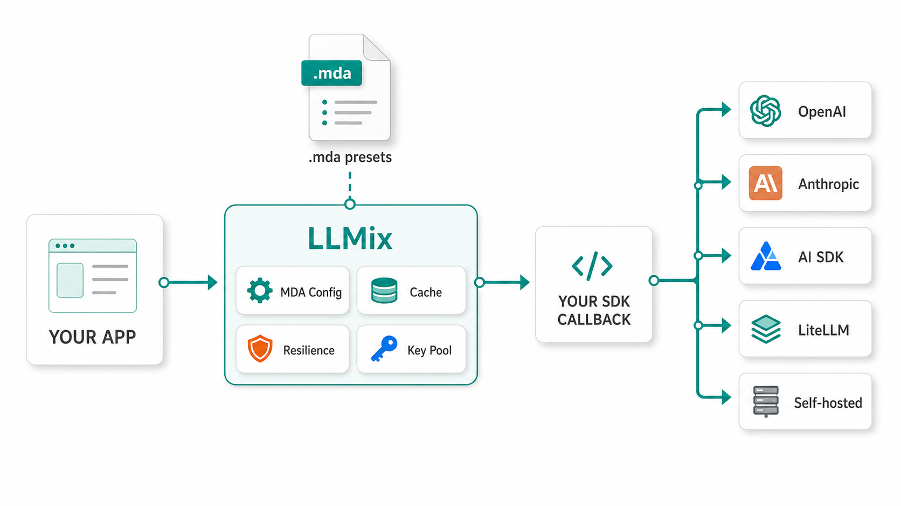
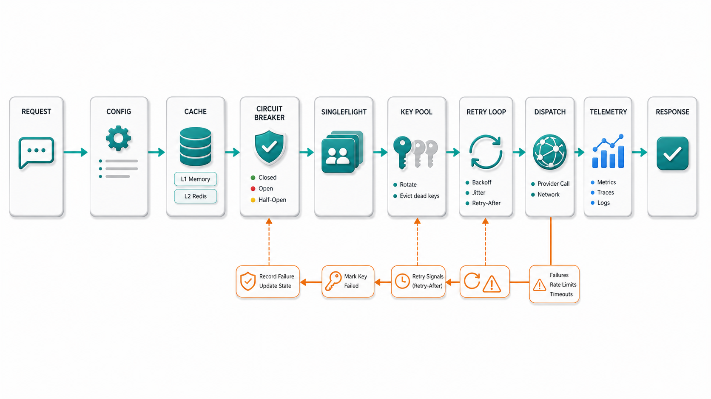

# LLMix

[](https://www.npmjs.com/package/@snoai/llmix)
[](https://pypi.org/project/sno-llmix/)
[](https://crates.io/crates/llmix-rs)
[](https://www.python.org/downloads/)
[](https://www.typescriptlang.org/)
[](https://www.rust-lang.org/)
[](../../LICENSE)

Read in other languages: [English](../../README.md) · [中文](README.zh-CN.md) · [Deutsch](README.de.md) · **Español** · [Français](README.fr.md) · [Русский](README.ru.md) · [한국어](README.ko.md) · [日本語](README.ja.md) · [हिन्दी](README.hi.md)

> Llamadas LLM guiadas por configuración para Python, TypeScript y Rust.
> Mantén tu SDK. Mueve el comportamiento del modelo a presets MDA. Pon cache, reintentos, rotación de claves y control de despliegue alrededor de la llamada.

LLMix es la capa entre tu producto y el SDK del proveedor.

No te pide reescribir tu código de OpenAI, Anthropic, Gemini, LiteLLM, AI SDK ni tus clientes propios. Envuelve la llamada. Las partes repetidas van alrededor: cache de respuestas, circuit breaker, key pools, singleflight, política de reintentos, concurrencia adaptativa, kwargs del proveedor y carga de configuración MDA.

El modelo deja de ser una cadena hard-coded dentro del código de la aplicación. Pasa a ser datos. Cambia un preset, publica un snapshot de registry, recarga el servicio y la siguiente solicitud puede usar otro proveedor u otro modelo. Sin redeploy para el cambio normal de modelo.

Eso es todo. Una capa pequeña. Con los bordes afilados ya limados.

---

## Por qué existe

Los productos de AI en 2026 no suelen fallar porque una llamada de SDK sea difícil.

Fallan en lo que rodea a la llamada. Una clave recibe rate limit. Un proveedor se vuelve lento. Doscientos usuarios preguntan lo mismo a la vez. Un cambio de modelo necesita deploy. Una clave de cache cambia por un parámetro invisible. Un servicio está en Python, otro en TypeScript, y el worker de Rust tiene que seguir el mismo contrato.

LLMix es para esa parte del sistema. La cadena de señal entre tu aplicación y el modelo.

El prompt sigue siendo tuyo. El SDK sigue siendo tuyo. LLMix se encarga del harness.

---

## Instalación

| Runtime | Package | Import path |
|---------|---------|-------------|
| TypeScript | `npm install @snoai/llmix` | `@snoai/llmix` |
| Python | `pip install sno-llmix` | `llmix` |
| Rust | `cargo add llmix-rs` | `llmix_rs` |

Python usa `sno-llmix` en PyPI porque `llmix` ya estaba ocupado. La ruta de import sigue siendo `llmix`.

Los helpers de proveedor usan SDKs opcionales. Instala solo los clientes de proveedor que vayas a llamar.

```bash
# TypeScript OpenAI-compatible helpers
npm install ai @ai-sdk/openai

# Python Redis cache support
pip install "sno-llmix[redis]"

# Rust OpenAI helper and Redis cache
cargo add llmix-rs --features providers-openai,redis
```

---

## Documentación

- [Usage reference](../llmix-usage-ref.md)
- [TypeScript guide](../llmix-typescript.md)
- [Python guide](../llmix-python.md)
- [Rust guide](../llmix-rust.md)
- [Secure LLMix configuration](../secure-llmix-configuration.md)
- [Key pool operations](../key-pool-operations.md)

---

## Vista rápida



LLMix envuelve una llamada de proveedor a la vez.

No es un router en el sentido de LiteLLM. Es más parecido al harness que terminas reconstruyendo alrededor de cada agent, coder tool, servicio de extracción y workflow interno de AI cuando llega tráfico real.

---

## Quick Start

### TypeScript

```typescript
import {
  CallPipeline,
  KeyPool,
  TwoTierCache,
  openaiDispatch,
} from "@snoai/llmix";

const pipeline = new CallPipeline({
  dispatch: openaiDispatch(),
  responseCache: new TwoTierCache("memory"),
});

pipeline.setKeyPool("openai", new KeyPool([process.env.OPENAI_API_KEY!]));

const response = await pipeline.call({
  config: {
    provider: "openai",
    model: "gpt-4o-mini",
    common: { temperature: 0.2, maxOutputTokens: 512 },
    caching: { strategy: "memory" },
  },
  messages: [
    { role: "user", content: "Explain LLMix in one sentence." },
  ],
});

console.log(response.content);
await pipeline.close();
```

### Python

```python
import asyncio
import os

from llmix import (
    CallInput,
    CallPipeline,
    KeyPool,
    PipelineConfig,
    TwoTierCache,
    openai_dispatch,
)


async def main() -> None:
    pipeline = CallPipeline(
        PipelineConfig(
            dispatch=openai_dispatch(),
            response_cache=TwoTierCache("memory"),
        )
    )

    pipeline.set_key_pool("openai", KeyPool([os.environ["OPENAI_API_KEY"]]))

    response = await pipeline.call(
        CallInput(
            config={
                "provider": "openai",
                "model": "gpt-4o-mini",
                "common": {"temperature": 0.2, "max_output_tokens": 512},
                "caching": {"strategy": "memory"},
            },
            messages=[
                {"role": "user", "content": "Explain LLMix in one sentence."}
            ],
        )
    )

    print(response.content)
    await pipeline.close()


asyncio.run(main())
```

### Rust

Rust expone el mismo contrato de pipeline. El helper de OpenAI está detrás de un feature flag.

```toml
[dependencies]
llmix-rs = { version = "2.0.0", features = ["providers-openai"] }
serde_json = "1"
tokio = { version = "1", features = ["macros", "rt"] }
```

```rust
use llmix_rs::{
    load_keys_from_env, CallInput, CallPipeline, OpenAiChatHelper, PipelineConfig,
};
use serde_json::json;

let pipeline = CallPipeline::new(PipelineConfig::new(OpenAiChatHelper::new()))?;
pipeline.set_key_pool("openai", load_keys_from_env("openai")?);

let response = pipeline
    .call(CallInput {
        config: json!({
            "provider": "openai",
            "model": "gpt-4o-mini",
            "common": { "temperature": 0.2, "max_output_tokens": 512 },
            "caching": { "strategy": "memory" }
        }),
        messages: vec![json!({
            "role": "user",
            "content": "Explain LLMix in one sentence."
        })],
        singleflight_key: None,
    })
    .await;
```

Consulta la [guía de Rust](../llmix-rust.md) para ejemplos completos de `main` y feature flags.

---

## Lo que añade a cada llamada



| Concern | What LLMix does |
|---------|-----------------|
| Response cache | L1 en memoria más Redis L2 opcional, con claves de cache canónicas entre runtimes |
| Key pools | Selección round-robin, rotación ante 429 y expulsión de claves muertas ante 401/403 |
| Retries | Backoff exponencial con jitter, respetando `Retry-After` |
| Circuit breaker | Alcance por provider y effective base URL |
| Singleflight | Colapsa trabajo concurrente idéntico en una sola solicitud upstream |
| Concurrency | Semaphore adaptativo AIMD, guiado por feedback de rate limit |
| Provider kwargs | La common config se convierte en campos específicos del proveedor |
| Thinking tokens | Extracción opcional de `<think>` hacia objetos de respuesta normalizados |
| Registry | Snapshots inmutables de config con un puntero live `current.json` |

Los valores por defecto están pensados para ser tranquilos. Ajústalos cuando el tráfico real te dé una razón.

---

## MDA Presets


LLMix usa MDA Source Mode para escribir configuración. Las notas humanas y los ajustes de runtime viven en un solo archivo. El runtime solo ve el JSON resuelto.

```mda
---
name: extraction
description: Entity extraction preset.
metadata:
  snoai-llmix:
    common:
      provider: openai
      model: gpt-4o-mini
      temperature: 0.2
      maxOutputTokens: 512
    caching:
      strategy: redis-or-memory
    providerOptions:
      openai:
        reasoningEffort: medium
---
# extraction

Extract named entities. Return compact JSON.
```

Puedes cargarlo directamente al escribir o probar:

```typescript
import { loadMdaConfig } from "@snoai/llmix";

const config = await loadMdaConfig("./config/llm/search/extraction.mda");
```

```python
from llmix import load_mda_config

config = load_mda_config("./config/llm/search/extraction.mda")
```

```rust
use llmix_rs::load_config;

let config = load_config("./config/llm/search/extraction.mda")?;
```

Para servicios de producción, usa el registry.

---

## Config Registry

Los archivos MDA editables son buenos para humanos. Los servicios en ejecución necesitan algo más silencioso.

LLMix Config Registry publica archivos de autoría como snapshots inmutables y content-addressed. El código de runtime lee el snapshot activo, no el árbol fuente mutable.

```text
config/llm/
  authoring/
    search/
      extraction.mda
  snapshots/
    2026-05-09T000000Z-...
  current.json
```

```python
from llmix import ConfigRegistryManager, ConfigRegistryPublisher, resolve_config_dir

root = resolve_config_dir().config_dir
ConfigRegistryPublisher(root).publish()

manager = ConfigRegistryManager.open(root)
config = manager.get_preset("search", "extraction")
```

```typescript
import {
  ConfigRegistryManager,
  ConfigRegistryPublisher,
  resolveConfigDir,
} from "@snoai/llmix";

const { configDir } = resolveConfigDir();
await new ConfigRegistryPublisher(configDir).publish();

const manager = await ConfigRegistryManager.open(configDir);
const config = await manager.getPreset("search", "extraction");
```

Los managers exponen la revisión activa y metadatos de salud de recarga. Eso permite decir exactamente qué configuración está ejecutando un servicio.

---

## Cobertura de proveedores

Los dispatch helpers públicos cubren los proveedores que realmente probamos.

| Provider | Python | TypeScript | Notes |
|----------|--------|------------|-------|
| OpenAI | `openai_dispatch` | `openaiDispatch` | OpenAI Responses y chat-style flows |
| Anthropic | `anthropic_dispatch` | `anthropicDispatch` | Messages API, thinking budget validation |
| Gemini | `gemini_dispatch` | `geminiDispatch` | Google GenAI-compatible params |
| OpenRouter | `openrouter_dispatch` | `openrouterDispatch` | OpenAI-compatible |
| DeepInfra | `deepinfra_dispatch` | `deepinfraDispatch` | OpenAI-compatible |
| Novita | `novita_dispatch` | `novitaDispatch` | OpenAI-compatible |
| Together | `together_dispatch` | `togetherDispatch` | OpenAI-compatible |
| Sno GPU | `sno_gpu_dispatch` | `snoGpuDispatch` | On-prem OpenAI-compatible GPU endpoints |

Rust hoy incluye el pipeline neutral y helpers con feature flags para OpenAI, Anthropic, Gemini y Sno GPU. Trata los helpers de proveedor de Rust como beta. Cache, key pool, registry, retry y el contrato de pipeline están alineados con Python y TypeScript.

Los proveedores OpenAI-compatible reutilizan la forma de request de OpenAI con manejo específico de `base_url`. Eso mantiene el contrato simple. Lo simple ayuda.

---

## Variables de entorno

| Variable | Purpose |
|----------|---------|
| `OPENAI_API_KEY` / `OPENAI_KEYS` | Clave OpenAI o key pool separado por comas |
| `ANTHROPIC_API_KEY` / `ANTHROPIC_KEYS` | Clave Anthropic o key pool separado por comas |
| `GEMINI_API_KEY` / `GEMINI_KEYS` | Clave Gemini o key pool separado por comas |
| `OPENROUTER_API_KEY` / `OPENROUTER_KEYS` | Clave OpenRouter o key pool separado por comas |
| `DEEPINFRA_API_KEY` / `DEEPINFRA_KEYS` | Clave DeepInfra o key pool separado por comas |
| `TOGETHER_API_KEY` / `TOGETHER_KEYS` | Clave Together o key pool separado por comas |
| `NOVITA_API_KEY` / `NOVITA_KEYS` | Clave Novita o key pool separado por comas |
| `SNO_LLM_API_KEY` | Fallback del dispatcher directo de Sno GPU |
| `SNO_GPU_API_KEY` / `SNO_GPU_KEYS` | Variables de key pool de Sno GPU para provider id `sno-gpu` |
| `GPU_BASE_URL` | Sno GPU base URL |
| `REDIS_URL` | URL de Redis response-cache |
| `LLMIX_STATE_DIR` | Lock files, batch metadata y kill-switch state |

`load_keys_from_env("provider-name")` revisa primero `PROVIDER_NAME_KEYS` y luego `PROVIDER_NAME_API_KEY`. Los guiones se convierten en guiones bajos.

---

## Lo que no es

- No es un framework de streaming. El streaming se queda en tu SDK.
- No es un framework de prompts. Trae tu propia capa de prompts.
- No es un marketplace de proveedores. Una llamada usa el provider indicado por su config.
- No es una razón para esconder cada decisión de modelo detrás de indirección. Algunas cosas deben quedarse en código.

LLMix es útil cuando la misma forma de llamada de modelo aparece en varios servicios. Si tienes un solo script y una sola clave, probablemente todavía no lo necesitas.

---

## Desarrollo

```bash
# TypeScript
bun install
bun test
bunx tsc -p tsconfig.check.json

# Python
uv sync
uv run pytest tests/python/
uv run pyright

# Rust
cargo test --manifest-path rust/llmix-rs/Cargo.toml
cargo clippy --manifest-path rust/llmix-rs/Cargo.toml -- -D warnings
```

---

## License

[Apache-2.0](../../LICENSE)

## Related

- [AI SDK](https://ai-sdk.dev/)
- [Promptix](https://github.com/sno-ai/promptix)
